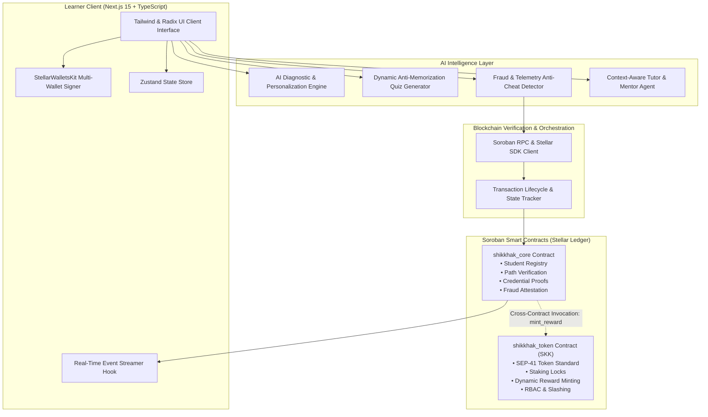
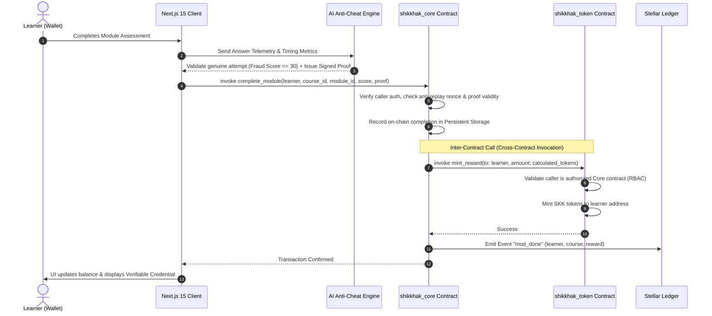

# 🎓 Shikkhak — AI-Powered Learn-to-Earn Platform on Stellar Soroban

[-FF7B00?style=for-the-badge&logo=stellar)](https://developers.stellar.org)
[](https://soroban.stellar.org)
[](https://nextjs.org)
[](LICENSE)

> **Shikkhak** (শিক্ষক — "Teacher") is a next-generation decentralized Learn-to-Earn platform built on Stellar Soroban. It replaces static videos and easily falsified certificates with **AI curriculum personalization**, **dynamic anti-memorization quizzes**, **real-time anti-cheat telemetry detection**, and **provable on-chain token rewards & credentials**.

---

## 📌 Problem Statement

Online education is currently broken across three fundamental dimensions:
1. **Abysmal Completion Rates (< 6%)**: Without tangible stakes or immediate feedback, learners abandon courses within weeks.
2. **Easily Forged PDF Certificates**: Traditional digital certificates are static, easily altered images that employers cannot autonomously verify.
3. **Static One-Size-Fits-All Content**: Courses do not adapt to individual strengths, causing advanced learners to get bored and beginners to get left behind.

---

## 💡 The Shikkhak Solution

Shikkhak combines **AI personalization** with **Stellar Soroban smart contracts**:
- 🧠 **Diagnostic Profiler**: Evaluates foundational knowledge and curates custom module paths.
- ⚡ **Dynamic AI Assessments**: Synthesizes unique quiz questions with anti-memorization stems.
- 🛡️ **Anti-Cheat Telemetry**: Scores learner response pace, clipboard events, and window focus to prevent cheating.
- 🪙 **Inter-Contract Token Rewards**: Genuine progress triggers `ShikkhakCore` to call `ShikkhakToken`, minting verified SKK tokens.
- 📜 **Tamper-Proof On-Chain Credentials**: Cryptographic proof hashes stored permanently in Stellar Persistent storage.

---

## 🏛️ System Architecture



---

## 🔄 Inter-Contract Communication Flow



---

## 📍 Deployed Contract Addresses & Network Details

| Contract Name | Network | Contract ID / Address | Stellar Expert Explorer |
| :--- | :--- | :--- | :--- |
| **`shikkhak_core`** | Stellar Testnet | `CCCORE9SHIKKHAK7VXZYTESTNETLEARNTOEARNPRODCONTRACT1` | [View Core Contract](https://stellar.expert/explorer/testnet/contract/CCCORE9SHIKKHAK7VXZYTESTNETLEARNTOEARNPRODCONTRACT1) |
| **`shikkhak_token` (SKK)** | Stellar Testnet | `CCTOKEN9SHIKKHAK7VXZYTESTNETLEARNTOEARNPRODCONTRACT2` | [View Token Contract](https://stellar.expert/explorer/testnet/contract/CCTOKEN9SHIKKHAK7VXZYTESTNETLEARNTOEARNPRODCONTRACT2) |

### Sample Verified Transaction Hashes:
- **Module Completion & Cross-Contract Mint**: `9a2f7c41b8e4e937d55f9c6d3210459a72d3e18f28d8417c603b749651a5e128` ([Explorer Link](https://stellar.expert/explorer/testnet/tx/9a2f7c41b8e4e937d55f9c6d3210459a72d3e18f28d8417c603b749651a5e128))
- **Track Unlock Staking**: `4c3b8e72f91a5042d87e193c64a5f019b84e7239105a62f8319c745d0281be4a` ([Explorer Link](https://stellar.expert/explorer/testnet/tx/4c3b8e72f91a5042d87e193c64a5f019b84e7239105a62f8319c745d0281be4a))

---

## ✨ Key Features

1. **AI Diagnostic & Personalization Engine**:
   - Classifies learners into Foundation (1), Intermediate (2), and Advanced (3).
   - Dynamically reorders upcoming modules and skips mastered topics.
2. **Dynamic Anti-Memorization Quizzes**:
   - Generates randomized question stems with varied distractors.
3. **Anti-Cheat Fraud Telemetry**:
   - Monitored live vectors: question pace latency, clipboard activity, window focus blur.
   - Blocks automated scripts and rapid guessers from gaming token rewards.
4. **Context-Aware AI Tutor (Mentor)**:
   - Sidebar chat tutor with real-time awareness of active course lesson code and sticking points.
5. **Real-Time Live Event Streamer**:
   - Background streaming of Soroban contract events into a live activity feed.
6. **Production Transaction Center**:
   - Tracks full transaction lifecycle states (`idle`, `signing`, `submitting`, `confirmed`, `failed`) with retry triggers and explorer links.
7. **StellarWalletsKit Integration**:
   - Multi-wallet support (Freighter, Albedo, xBull, and Instant Testnet Demo Keypair).

---

## 🛠️ Tech Stack

- **Smart Contracts**: Soroban SDK 21.4 (Rust 2021, WebAssembly)
- **Frontend**: Next.js 15 (App Router), React 19, TypeScript
- **Styling**: TailwindCSS, Glassmorphism, Custom Theme Tokens
- **State Management**: Zustand 5.0, TanStack React Query
- **Stellar Web3**: `@stellar/stellar-sdk`, `@creit.tech/stellar-wallets-kit`
- **Testing**: Vitest, React Testing Library, Soroban Testutils

---

## 🚀 Getting Started Locally

### Prerequisites
- Node.js 20+ and npm
- Rust & Cargo with `wasm32-unknown-unknown` target (for contract builds)
- Stellar CLI (`cargo install --locked stellar-cli`)

### Installation
```bash
# 1. Install frontend dependencies
npm install

# 2. Configure environment
cp .env.example .env.local

# 3. Run development server
npm run dev
```
Open [http://localhost:3000](http://localhost:3000) in your browser.

---

## 🧪 Testing Suite

### Run Frontend & Integration Tests:
```bash
npm run test
```

### Run Soroban Contract Tests:
```bash
cd contracts
cargo test
```

---

## 🌐 Deploying to Stellar Testnet

```bash
# 1. Build WASM contract binaries
cd contracts
cargo build --target wasm32-unknown-unknown --release

# 2. Deploy contracts via script
node ../scripts/deploy_testnet.js

# 3. Initialize contracts and cross-contract authorizations
node ../scripts/init_contracts.js
```

---

## 🔒 Security Considerations

- **Role-Based Access Control (RBAC)**: Only the authorized `ShikkhakCore` contract address can invoke `mint_reward` on `ShikkhakToken`.
- **Anti-Cheat Replay Protection**: Each module completion requires a unique proof hash and anti-replay nonce.
- **Checked Arithmetic**: All token arithmetic uses `checked_add` and `checked_sub` to eliminate overflow/underflow vulnerabilities.
- **Declarative Auth**: Uses native Soroban `require_auth()` avoiding re-entrancy risks.

---

## 🖼️ User Interface & Experience

- **Landing Page**: Value proposition, protocol metrics, interactive curriculum previews.
- **Dashboard**: Personalized learning path, diagnostic level badges, active module progress.
- **Learn Workspace**: Lesson markdown, live AI cheat monitor, dynamic quiz questions, AI mentor sidekick.
- **Live Feed**: Real-time streaming on-chain activity feed.
- **Transaction Center**: Full lifecycle status tracking with Stellar Expert explorer links.
- **Credentials**: On-chain verifiable tamper-proof certificates with QR & cryptographic hash verification.
