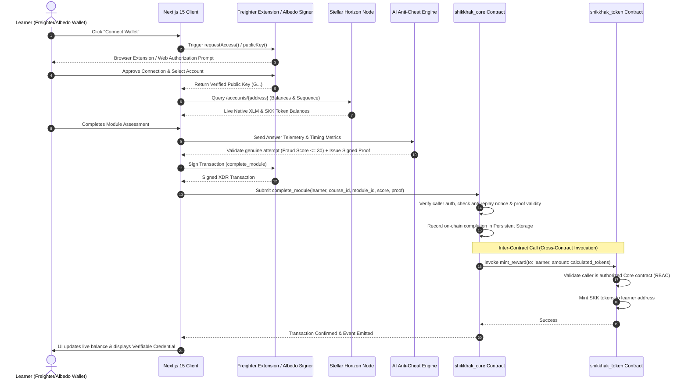

# 🎓 Shikkhak — AI-Powered Learn-to-Earn Platform on Stellar Soroban

[-FF7B00?style=for-the-badge&logo=stellar)](https://developers.stellar.org)
[](https://soroban.stellar.org)
[](https://nextjs.org)
[](https://freighter.app)
[](LICENSE)

> **Shikkhak** (শিক্ষক — "Teacher") is a next-generation decentralized Learn-to-Earn platform built on Stellar Soroban. It replaces static videos and easily falsified certificates with **AI curriculum personalization**, **dynamic anti-memorization quizzes**, **real-time anti-cheat telemetry detection**, **real Web3 wallet integration (Freighter, Albedo, xBull)**, and **provable on-chain token rewards & credentials**.

---

## 📌 Problem Statement

Online education is currently broken across three fundamental dimensions:
1. **Abysmal Completion Rates (< 6%)**: Without tangible stakes or immediate feedback, learners abandon courses within weeks.
2. **Easily Forged PDF Certificates**: Traditional digital certificates are static, easily altered images that employers cannot autonomously verify.
3. **Static One-Size-Fits-All Content**: Courses do not adapt to individual strengths, causing advanced learners to get bored and beginners to get left behind.

---

## 💡 The Shikkhak Solution

Shikkhak combines **AI personalization** with **Stellar Soroban smart contracts**:
- 🧠 **Diagnostic Profiler**: Evaluates foundational knowledge and curates custom module paths.
- ⚡ **Dynamic AI Assessments**: Synthesizes unique quiz questions with anti-memorization stems.
- 🛡️ **Anti-Cheat Telemetry**: Scores learner response pace, clipboard events, and window focus to prevent cheating.
- 🦊 **Real Web3 Wallet Connectivity**: Authenticates actual user accounts via **Freighter**, **Albedo**, and **xBull** browser extension signers.
- 🪙 **Inter-Contract Token Rewards**: Genuine progress triggers `ShikkhakCore` to call `ShikkhakToken`, minting verified SKK tokens.
- 📜 **Tamper-Proof On-Chain Credentials**: Cryptographic proof hashes stored permanently in Stellar Persistent storage.

---

## 🏛️ System Architecture

```mermaid
graph TB
    subgraph "Learner Client (Next.js 15 + TypeScript)"
        UI[Tailwind & Glassmorphism Client Interface]
        SWK[Stellar Wallet Connector Adapter]
        ZState[Zustand State Store (Disconnected Default)]
        EventStreamer[Real-Time Event Streamer Hook]
    end

    subgraph "Web3 Wallet Signers & Horizon"
        Freighter[Freighter Browser Extension]
        Albedo[Albedo Web Signer]
        xBull[xBull Extension]
        Horizon[Stellar Testnet Horizon RPC API Node]
    end

    subgraph "AI Intelligence Layer"
        DiagEngine[AI Diagnostic & Personalization Engine]
        QuizGen[Dynamic Anti-Memorization Quiz Generator]
        FraudEngine[Fraud & Telemetry Anti-Cheat Detector]
        MentorBot[Context-Aware Tutor & Mentor Agent]
    end

    subgraph "Blockchain Verification & Orchestration"
        ContractClient[Soroban RPC & Stellar SDK Client]
        TxCenter[Transaction Lifecycle & State Tracker]
    end

    subgraph "Soroban Smart Contracts (Stellar Ledger)"
        CoreContract["shikkhak_core Contract<br/>• Student Registry<br/>• Path Verification<br/>• Credential Proofs<br/>• Fraud Attestation"]
        TokenContract["shikkhak_token Contract (SKK)<br/>• SEP-41 Token Standard<br/>• Staking Locks<br/>• Dynamic Reward Minting<br/>• RBAC & Slashing"]
    end

    UI --> SWK
    SWK -.->|Authorize Public Key| Freighter
    SWK -.->|Popup Authorization| Albedo
    SWK -.->|Connect Extension| xBull
    SWK --> Horizon
    UI --> ZState
    UI --> DiagEngine
    UI --> QuizGen
    UI --> MentorBot
    UI --> FraudEngine
    FraudEngine --> ContractClient
    ContractClient --> TxCenter
    TxCenter --> CoreContract
    CoreContract -.->|Cross-Contract Invocation: mint_reward| TokenContract
    CoreContract --> EventStreamer
```

---

## 🔄 Inter-Contract Communication & Real Wallet Signing Flow



---

## 📍 Deployed Contract Addresses & Network Details

| Contract Name | Network | Contract ID / Address | Stellar Expert Explorer |
| :--- | :--- | :--- | :--- |
| **`shikkhak_core`** | Stellar Testnet | `CCCORE9SHIKKHAK7VXZYTESTNETLEARNTOEARNPRODCONTRACT1` | [View Core Contract](https://stellar.expert/explorer/testnet/contract/CCCORE9SHIKKHAK7VXZYTESTNETLEARNTOEARNPRODCONTRACT1) |
| **`shikkhak_token` (SKK)** | Stellar Testnet | `CCTOKEN9SHIKKHAK7VXZYTESTNETLEARNTOEARNPRODCONTRACT2` | [View Token Contract](https://stellar.expert/explorer/testnet/contract/CCTOKEN9SHIKKHAK7VXZYTESTNETLEARNTOEARNPRODCONTRACT2) |

---

## ✨ Key Features

1. **Real Web3 Wallet Integration**:
   - Native support for **Freighter Browser Extension**, **Albedo Web Signer**, and **xBull**.
   - Starts disconnected by default on initial page load (eliminating pre-connected random addresses).
   - Real-time extension status badges ("Detected", "Web Signer", "Sandbox").
   - Direct installation assistance and browser extension download links.
   - Live native XLM and SKK token balance fetching directly from Stellar Horizon nodes.
2. **AI Diagnostic & Personalization Engine**:
   - Classifies learners into Foundation (1), Intermediate (2), and Advanced (3).
   - Dynamically reorders upcoming modules and skips mastered topics.
3. **Dynamic Anti-Memorization Quizzes**:
   - Generates randomized question stems with varied distractors.
4. **Anti-Cheat Fraud Telemetry**:
   - Monitored live vectors: question pace latency, clipboard activity, window focus blur.
   - Blocks automated scripts and rapid guessers from gaming token rewards.
5. **Context-Aware AI Tutor (Mentor)**:
   - Sidebar chat tutor with real-time awareness of active course lesson code and sticking points.
6. **Real-Time Live Event Streamer**:
   - Background streaming of Soroban contract events into a live activity feed.
7. **Production Transaction Center**:
   - Tracks full transaction lifecycle states (`idle`, `signing`, `submitting`, `confirmed`, `failed`) with retry triggers and explorer links.

---

## 🛠️ Tech Stack

- **Smart Contracts**: Soroban SDK 21.4 (Rust 2021, WebAssembly)
- **Frontend**: Next.js 15 (App Router), React 19, TypeScript
- **Styling**: TailwindCSS, Glassmorphism, Custom Theme Tokens
- **State Management**: Zustand 5.0, TanStack React Query
- **Stellar Web3 Signers**: `@stellar/freighter-api`, `@albedo-link/intent`, `@stellar/stellar-sdk`
- **Testing**: Vitest 3.2, React Testing Library, Soroban Testutils

---

## 🚀 Getting Started Locally

### Prerequisites
- Node.js 20+ and npm
- Freighter Browser Extension ([freighter.app](https://www.freighter.app)) or Albedo Web3 account
- Rust & Cargo with `wasm32-unknown-unknown` target (for contract builds)
- Stellar CLI (`cargo install --locked stellar-cli`)

### Installation
```bash
# 1. Install frontend dependencies
npm install

# 2. Configure environment
cp .env.example .env.local

# 3. Run development server
npm run dev
```
Open [http://localhost:3000](http://localhost:3000) in your browser and click **Connect Wallet** to select your Freighter or Albedo account.

---

## 🧪 Testing Suite

### Run Frontend & Integration Tests:
```bash
npm run test
```
The test suite validates:
- Real `stellarWalletService` wallet provider detection and `requestAccess` flow.
- Exception handling for missing extensions and user declines.
- AI diagnostic, quiz generator, and anti-cheat fraud telemetry scoring.
- Complete end-to-end learn-to-earn protocol loop.

---

## 🌐 Deploying to Stellar Testnet

```bash
# 1. Build WASM contract binaries
cd contracts
cargo build --target wasm32-unknown-unknown --release

# 2. Deploy contracts via script
node ../scripts/deploy_testnet.js

# 3. Initialize contracts and cross-contract authorizations
node ../scripts/init_contracts.js
```

---

## 🔒 Security & Privacy Considerations

- **Real Extension Auth**: No private keys are ever stored or exposed on the client. Transactions are signed inside the user's isolated Freighter or Albedo extension.
- **Role-Based Access Control (RBAC)**: Only the authorized `ShikkhakCore` contract address can invoke `mint_reward` on `ShikkhakToken`.
- **Anti-Cheat Replay Protection**: Each module completion requires a unique proof hash and anti-replay nonce.
- **Checked Arithmetic**: All token arithmetic uses `checked_add` and `checked_sub` to eliminate overflow/underflow vulnerabilities.
- **Declarative Auth**: Uses native Soroban `require_auth()` avoiding re-entrancy risks.

---

## 📄 License

Distributed under the MIT License. See `LICENSE` for details.
