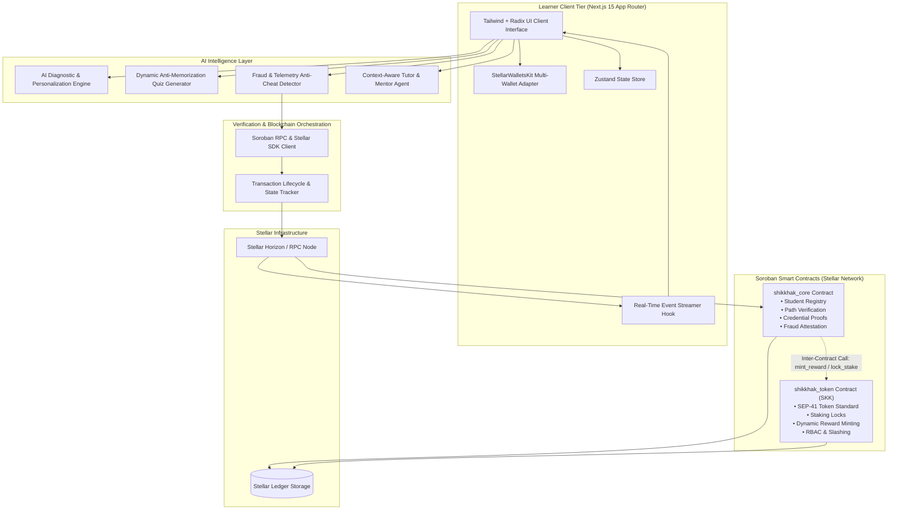
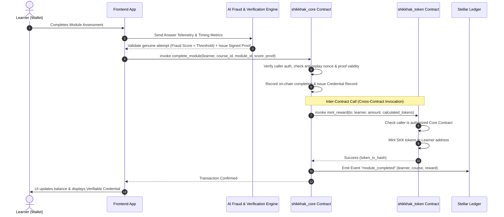

# Shikkhak Architecture & System Design Document

## 1. System Overview
**Shikkhak** is an AI-powered learn-to-earn decentralized platform deployed on the **Stellar Network** using **Soroban Smart Contracts**. It combines adaptive AI curriculum modeling, dynamic assessment generation, fraud telemetry analysis, and on-chain credentialing to make educational achievements provably verifiable and economically rewarding.

---

## 2. High-Level System Architecture

---

## 3. Soroban Smart Contract Architecture & Inter-Contract Communication

---

## 4. Multi-Contract Security & Access Control (RBAC)

1. **`shikkhak_token` Contract**:
   - **Role ADMIN**: Configures staking APR, authorized minters, and contract metadata.
   - **Role MINTER**: Only authorized `shikkhak_core` contracts can invoke `mint_reward`.
   - **Role USER**: Can transfer, approve allowances, stake tokens for premium course access, or unstake.
2. **`shikkhak_core` Contract**:
   - **Role ADMIN**: Adds courses, sets module token reward multipliers, and manages fraud Oracle keys.
   - **Role ORACLE/AI_ATTESTER**: Attests quiz validity and anti-cheat passing parameters.
   - **Role LEARNER**: Enrolls, records diagnostic baseline levels, and submits verified quiz proofs.
